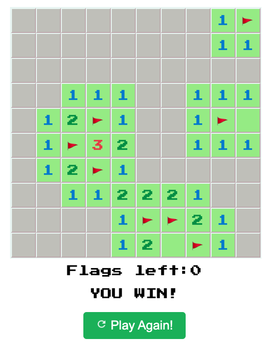

# Minesweeper Game
Link to the game: https://zhloui.github.io/Minesweeper2/

## Description

**Minesweeper** Minesweeper is a traditional single-player puzzle game where players aim to uncover all squares on a grid without revealing any bombs. Each square displays a number, indicating the count of neighboring squares containing bombs. The objective is to tactically mark potential bomb locations with flags.

## Screenshot

## Technologies Used

- **HTML**
- **CSS**
- **JavaScript**

## Getting Started

To play Minesweeper, you can access the deployed game by this link: https://zhloui.github.io/Minesweeper2/. Follow these instructions:

1. Open the provided link in your web browser.
2. The game board will be displayed with an initial set of uncovered squares.
3. Left-click on a square to reveal its content. Numbers indicate the adjacent bomb count.
4. Right-click on a square to place a flag, indicating a potential bomb.
5. Uncover all non-bomb squares to win the game.
6. If you click on a bomb, the game is over.
7. Flags left are displayed at the bottom.
8. Enjoy the game and try to win!

## Next Steps

Planned future enhancements (icebox items) include:

- Improved responsiveness for various screen sizes.
- Implementing buttons to choose between different difficulty levels.
- Adding a timer to track the duration of each game.

